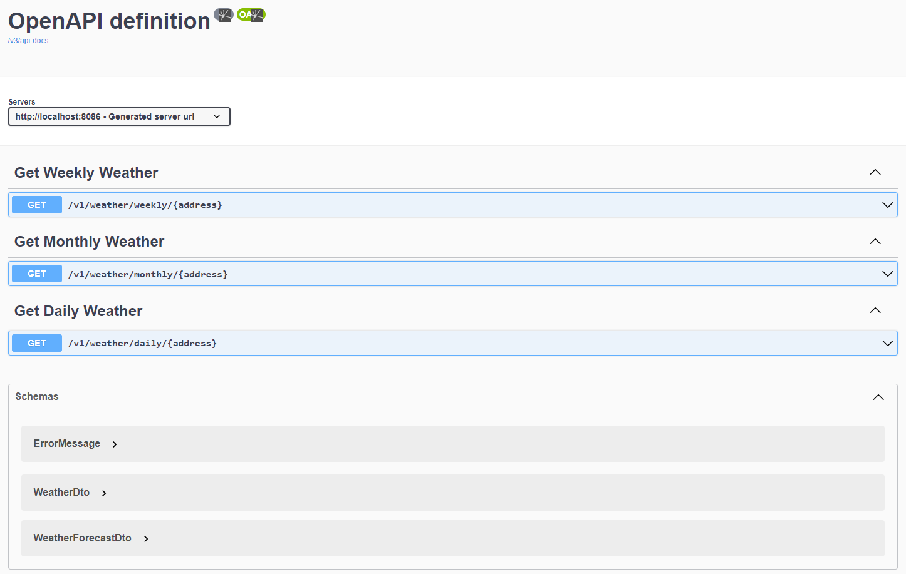

# Weather API - Patika.dev & DefineX Java Spring Practicum

## Homework - 3

An application for getting daily, weekly and monthly weather forecasts using Rest Template

## Running the application locally

There are several ways to run a Spring Boot application on your local machine. One way is to execute the `main` method in the `com.fcesur.weatherapplication.WeatherApplication` class from your IDE.

Alternatively you can use the [Spring Boot Maven plugin](https://docs.spring.io/spring-boot/docs/current/reference/html/build-tool-plugins-maven-plugin.html) like so:

```shell
mvn spring-boot:run
```

## REST API

### Swagger



### /v1/weather/daily/:address

`GET` : Get daily weather

### /v1/weather/weekly/:address

`GET` : Get weekly weather

### /v1/weather/monthly/:address

`GET` : Get monthly weather